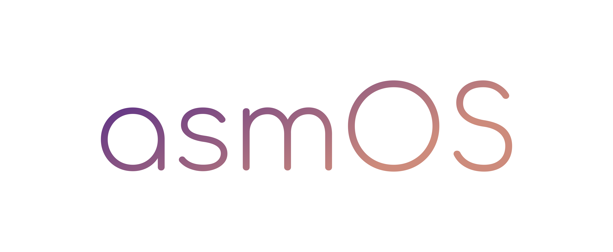

<div align="center">
    
</div>

<div align="center">
    &nbsp
    
    &nbsp
    
    &nbsp
    
</div>

<br>

<div align="center">
    <a href="https://github.com/mansoormemon/asmOS/actions/workflows/rust.yml">
        
    </a>
    <a href="https://github.com/mansoormemon/asmOS/actions/workflows/mdbook.yml">
        
    </a>
    <a href="LICENSE.md">
        
    </a>
</div>

<br>

<p align="justify">
<b>asmOS</b> is a modular operating system with a microkernel architecture that allows for easy customization and
extension. The operating system aims to provide a small set of essential services, such as memory management, process
scheduling, and interrupt handling. Additional services can be added through modules, which can be loaded and unloaded
dynamically.
</p>

<p align="justify">
This is a private project intended for experimentation and exploration in the field of low-level system programming.
While it is designed to be lightweight and customizable, it is not intended for production use. The microkernel
architecture and modular design provide an excellent platform for learning and tinkering with operating systems.
</p>

## Features

- Modular design with a microkernel architecture.
- Rust-based implementation for reliability and safety.
- As of now, only <b>x86_64</b> architecture is supported.

## Getting Started

To build and run asmOS, you will need:

- Rustc, a compiler for Rust, the nightly channel (`>= 22-02-2023`)
- Cargo, a package manager for Rust.
- QEMU, an emulation system.

Kindly note that running <b>asmOS</b> on bare-metal is not recommended.

### Building and Running

1. Clone the repository and navigate to the project directory.
2. To build the project.

   ```shell
   cargo build --release
   ```

3. To run the operating system in QEMU.

   ```shell
   cargo run --release
   ```

## Author

Mansoor Ahmed Memon

- https://github.com/mansoormemon

## Links

- [Repository](https://github.com/mansoormemon/asmOS)
- [Documentation](https://mansoormemon.github.io/asmOS)

## License

This project is licensed under the [MIT License](LICENSE.md).

<br>

<p align="center">
   <b><sub><sup><small>Copyright 2023 © asmOS</small></sup></sub></b>
</p>
